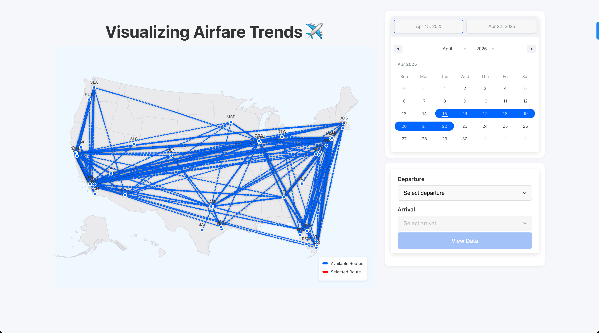

# Visualizing Airfare Trends ✈️

An interactive full-stack web application to explore historical U.S. airfare trends. Users can select specific flight routes and visualize dynamic pricing trends by quarter and year. Built with **React + TypeScript** on the frontend and **Flask + Pandas** on the backend.



---

## ⚠️ Prerequisites

Before running this project, ensure you have the following installed:

- 📦 [**Conda**](https://docs.conda.io/en/latest/miniconda.html) (for backend environment management)
- 🧰 [**Node.js & npm**](https://nodejs.org/) (for running the frontend)
- ✅ Git (to clone this repository)

---

## ⚙️ Setup Instructions

### 1. Clone the Repository
Open a new terminal and run:

```bash
git clone https://github.com/Ishxnnn/visualizing-airfare-trends.git
cd visualizing-airfare-trends
```

### 2. Backend Setup (Flask + Pandas)
In the same terminal, run:

```bash
cd visualizing-airfare-trends-backend
conda env create -f environment.yml
conda activate visualizing_airfare_trends_backend
python app.py
```

In your web browser, navigate to `http://localhost:5000`.
You should see the message: `Flight Data API is running!`

> **Note for macOS users:**  
If you encounter an error with port `5000` already in use when starting the backend, try disabling the **AirPlay Receiver** from:  
**System Settings → General → AirDrop & Handoff → AirPlay Receiver** → **Turn Off** temporarily.


### 3. Frontend Setup (React + Vite)
In a new terminal, run:

```bash
cd ../visualizing-airfare-trends-frontend
npm install
npm run dev
```

In your web browser, navigate to `http://localhost:5173`.
The app should now be fully functional in your browser.

## 🧠 Features

* 🗺️ Interactive flight route map
* ✈️ Route selection with blinking red animation
* 📅 Calendar-based quarter/year filters
* 📊 Dynamic quarterly and yearly pricing panels
* 🧮 Fare prediction using a decision tree model
* 🔍 Auto-scroll to relevant quarters/years based on selected dates
* ⚡ Dotted-line animation that mimics flight motion

## 🗂️ Folder Structure

```
visualizing-airfare-trends/
├── visualizing-airfare-trends-backend/
│   ├── app.py
│   └── environment.yml
├── visualizing-airfare-trends-frontend/
│   ├── src/
│   └── index.html
└── README.md
```

## 💻 Tech Stack

* **Frontend:** React, TypeScript, Vite, CSS Modules
* **Visualization:** react-simple-maps, D3
* **Backend:** Flask, Pandas, NumPy
* **Data:** FAA fare and passenger route data
